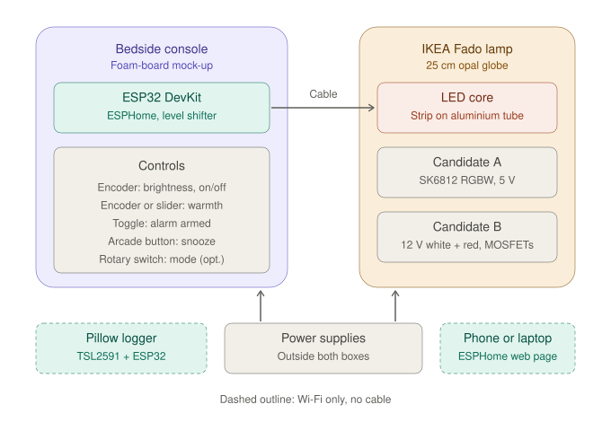
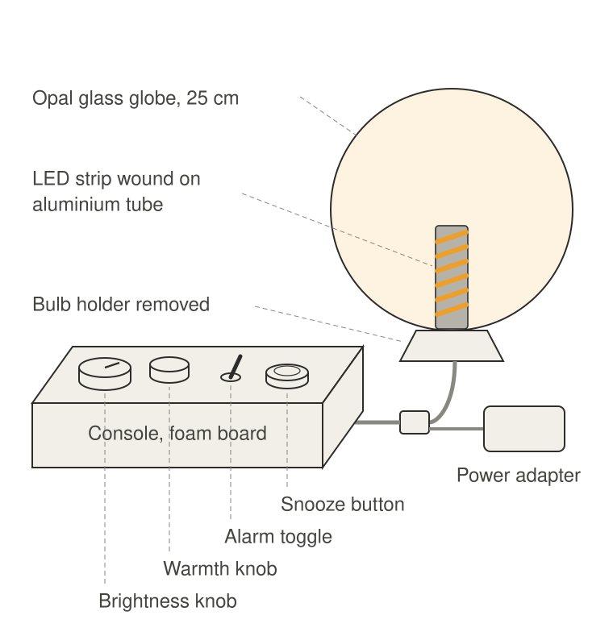

<!--
SPDX-FileCopyrightText: 2026 Joe Heffer

SPDX-License-Identifier: CC-BY-SA-4.0
-->

# First prototype

The first prototype is a bench and bedside test rig. Its purpose is to choose an LED, tune the dawn curve and try out the controls before any custom enclosure or PCB is designed.

## Layout

* **Bedside console.** A foam-board box holding an ESP32 DevKit on a breadboard and the tactile controls. The ESP32 runs ESPHome.
* **Lamp.** An IKEA Fado with the bulb holder and original flex removed. An LED strip is wound round a short aluminium tube standing in the base, facing out at the globe.
* **LED candidates.** Candidate A is an SK6812 RGBW strip (5 V). Candidate B is a pair of 12 V strips, warm white and red, driven by logic-level MOSFETs. Only one is fitted at a time, and each has its own connector type so the wrong supply cannot be connected.
* **Power.** The supply sits outside both boxes. Strip current runs from a screw terminal straight to the lamp and does not pass through the breadboard.
* **Test tools.** A pillow light logger (TSL2591 and a second ESP32) records light levels over Wi-Fi. Settings and schedules are reached through the ESPHome web page.

## Line drawing

The drawing is not to scale. The 60 mm slider (an alternative warmth control) and the optional three-position mode switch are not shown.

## Open questions

* The README states that Dimpsy will be powered by USB-C only. Candidate B needs a 12 V supply, and candidate A is planned with a separate 5 V 4 A adapter. Decide whether these are acceptable for the bench prototype only, or whether candidate B should be dropped or run from USB-C Power Delivery.
* Fado or Tokabo: these drawings assume the Fado.
